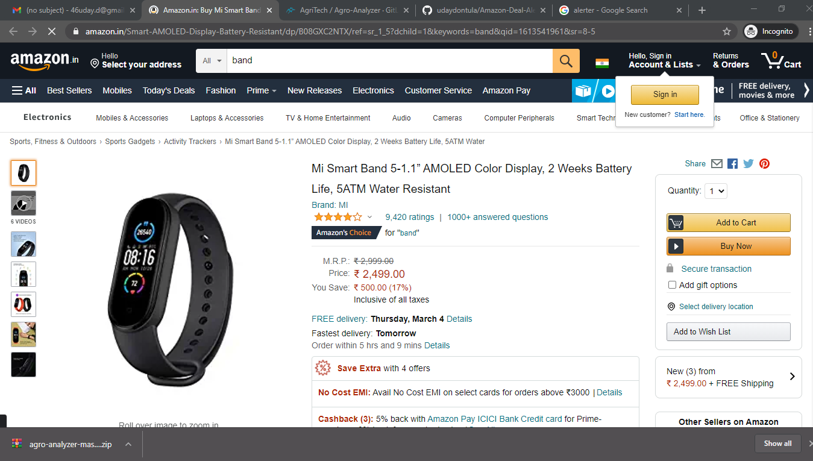
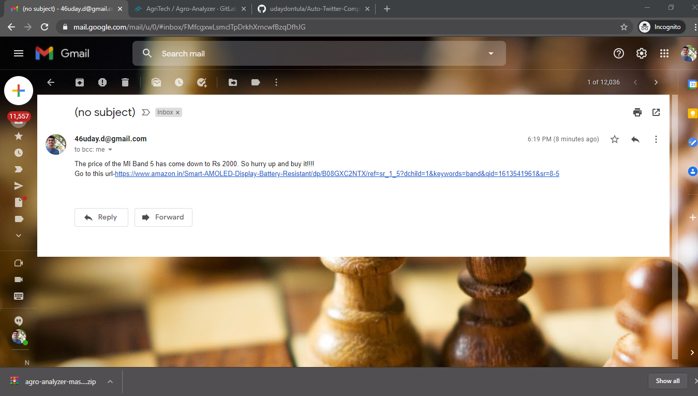

# Amazon-Deal-Alerter
It is an alert sender python program. It sends an email when the prices of the product in Amazon is in our budget. We have to specify the product details i.e the link of the product in Amazon website and the price details you wanna pay for that product. It will send us an email to our email id when the price of the product is less then or equal to your given price. It sends an email using SMTP.

## Technologies
- Python
- SMTP
- requests

## Preview

**Product price detail**

**Email sent**

